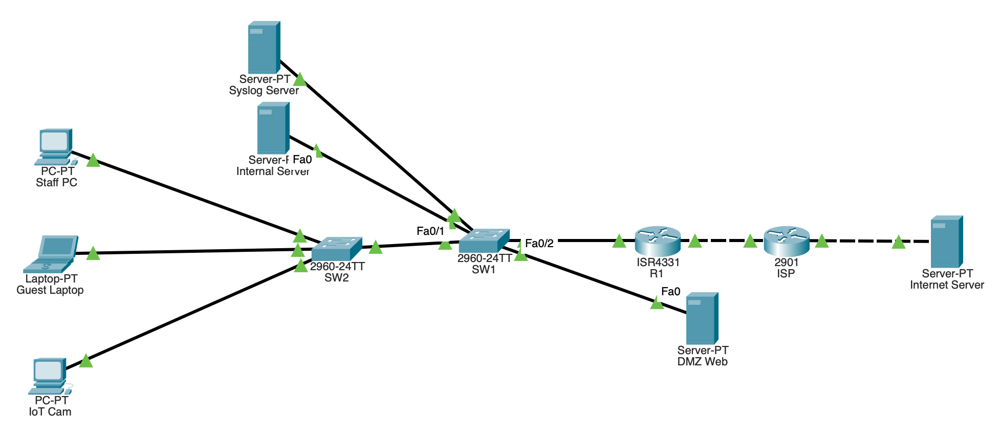

# Secure Small-Office Network (Cisco Packet Tracer)

A segmented and hardened small-office/home-office (SOHO) network built and tested in Cisco Packet Tracer: VLANs, a DMZ web server, ACLs, NAT, DHCP, SSH-only management and central syslog logging.

## Overview

I built this to learn how real networks are separated and defended. It models a small office with Staff, Guest, IoT and Server networks, a public web server in a DMZ, and a simulated internet. Each control is tested with both **tests that should succeed** and **tests that should fail**, so the evidence shows traffic being allowed and blocked on purpose.

**Skills shown:** network segmentation, router-on-a-stick, ACL design, NAT/PAT, DHCP, device hardening, port security, centralised logging, threat modelling and troubleshooting.

**Tools:** Cisco Packet Tracer 8.x, GitHub (both free).

## Topology



Devices: 1 router (ISR4331, `R1`), 1 pretend ISP router (2901), 2 switches (2960), Staff PC, Guest Laptop, IoT Cam (a PC standing in for a camera), Internal Server, DMZ Web server, Syslog Server and an Internet Server.

## Addressing and VLANs

| Network | VLAN | Subnet | Gateway (R1) | Purpose |
|---|---|---|---|---|
| Staff | 10 | 192.168.10.0/24 | 192.168.10.1 | Trusted workstations (DHCP) |
| Guest | 20 | 192.168.20.0/24 | 192.168.20.1 | Visitors, internet only (DHCP) |
| IoT | 30 | 192.168.30.0/24 | 192.168.30.1 | Cameras and smart devices, internet only (DHCP) |
| Servers | 40 | 192.168.40.0/24 | 192.168.40.1 | Internal Server, Syslog Server (static) |
| DMZ | 50 | 172.16.50.0/24 | 172.16.50.1 | Public web server (static) |
| Management | 99 | 192.168.99.0/24 | 192.168.99.1 | Switch and router admin addresses |
| Dead native | 999 | none | none | Unused. Native VLAN and parking VLAN for shut ports |

| Link | Addresses |
|---|---|
| R1 to ISP | R1 `203.0.113.2/29`, ISP `203.0.113.1/29` |
| DMZ public address (static NAT) | `203.0.113.3` maps to `172.16.50.10` |
| ISP to Internet Server | ISP `198.51.100.1/24`, server `198.51.100.10` |

## Security controls

| Control | Where | Attack it prevents |
|---|---|---|
| Separate VLANs per trust zone | SW1, SW2, R1 | Flat-network lateral movement |
| Static trunks, DTP disabled (`nonegotiate`), allowed-VLAN list | SW1, SW2 | VLAN hopping by trunk negotiation |
| Unused native VLAN 999 | SW1, SW2, R1 | VLAN hopping by double tagging |
| SSH v2 only, Telnet refused | R1, SW1, SW2 | Telnet password sniffing |
| Hashed `enable secret` and `username secret`, login banner | R1, SW1, SW2 | Readable credentials in configs, unwarned access |
| Port security (sticky, max 1, shutdown) | SW1, SW2 access ports | Rogue devices on a known port |
| Unused ports shut down in VLAN 999 | SW1, SW2 | Intruders using empty sockets |
| Inbound extended ACLs per VLAN | R1 | Lateral movement from Guest, IoT and DMZ |
| PAT plus one static NAT | R1 | Direct inbound access to internal hosts |
| DMZ in its own VLAN, replies only | R1 | A compromised web server pivoting inward |
| Central syslog in the Servers VLAN | R1, SW1, SW2, Syslog Server | Unnoticed attacks, local log tampering |
| DHCP exclusions and per-VLAN pools | R1 | Address clashes with fixed devices |

## Test results

Each row is a real test run in this lab. **FAIL = blocked on purpose (the desired result).**

| # | Test | Expected | Result | Evidence |
|---|---|---|---|---|
| 1 | Staff PC to its gateway | Success | Pass | [01](screenshots/01-staff-to-gateway.png) |
| 2 | Staff PC to Internal Server | Success | Pass | [02](screenshots/02-staff-to-server.png) |
| 3 | **Before ACLs:** Guest to Internal Server | Success (the problem) | Reached the server | [03 BEFORE](screenshots/03-BEFORE-acl-guest-to-server.png) |
| 4 | **After ACLs:** Guest to Internal Server | Blocked | Blocked | [03 AFTER](screenshots/03-AFTER-acl-guest-to-server-BLOCKED.png) |
| 5 | Guest and IoT to the internet | Success | Pass | [23](screenshots/23-guest-to-internet.png), [24](screenshots/24-iot-to-internet.png) |
| 6 | Staff to Servers and IoT | Success | Pass | [25](screenshots/25-staff-to-server-ALLOWED.png), [26](screenshots/26-staff-to-iot-ALLOWED.png) |
| 7 | Guest to Staff and Management | Blocked | Blocked | [29](screenshots/29-guest-to-staff-BLOCKED.png), [30](screenshots/30-guest-to-mgmt-BLOCKED.png) |
| 8 | IoT to Staff and Servers | Blocked | Blocked | [31](screenshots/31-iot-to-staff-servers-BLOCKED.png) |
| 9 | DMZ Web to Internal networks | Blocked | Blocked | [32](screenshots/32-dmz-to-internal-BLOCKED.png) |
| 10 | DHCP lease on Guest | Address from `192.168.20.x` | Pass | [09](screenshots/09-dhcp-guest-ipconfig.png), [13](screenshots/13-dhcp-bindings.png) |
| 11 | Staff to internet through PAT | Success, translated | Pass | [10](screenshots/10-staff-to-internet.png), [11](screenshots/11-nat-translations.png) |
| 12 | Internet Server to DMZ web page | Success | Pass | [12](screenshots/12-internet-to-dmz-web.png), [12b](screenshots/12b-nat-internet-to-dmz.png) |
| 13 | Internet Server to private addresses | Blocked | Blocked | [14](screenshots/14-internet-to-private-FAIL.png) |
| 14 | SSH v2 login, banner, `enable` | Success | Pass | [15](screenshots/15-ssh-sw1-success.png), [15b](screenshots/15b-ssh-sw2-success.png), [16-17](screenshots/16-17-r1-ssh-and-hashes.png) |
| 15 | Telnet to a switch | Refused | Dropped immediately | [20](screenshots/20-telnet-refused-FAIL.png) |
| 16 | Port security configured | Enabled, max 1, sticky | Pass | [18](screenshots/18-port-security.png) |
| 17 | **Rogue device on a secured port** | Port shuts down | `err-disabled` | [21](screenshots/21-rogue-device-blocked-FAIL.png) |
| 18 | Unused port | Dead | Disabled in VLAN 999 | [19](screenshots/19-unused-ports-disabled.png), [22](screenshots/22-unused-port-dead-FAIL.png) |
| 19 | Devices log to the syslog server | Events arrive | Pass | [35](screenshots/35-r1-show-logging.png), [36](screenshots/36-syslog-server-events.png), [39](screenshots/39-switch-logging.png) |
| 20 | Port violation logged centrally | Message on server | Pass | [38](screenshots/38-port-violation-logged.png) |
| 21 | Guest and IoT to the log server | Blocked | Blocked | [40](screenshots/40-guest-to-syslog-BLOCKED.png), [41](screenshots/41-iot-to-syslog-BLOCKED.png) |
| 22 | Staff to the log server | Success | Pass | [42](screenshots/42-staff-to-syslog-ALLOWED.png) |

ACL rule hit counters (which rule blocked what): [33](screenshots/33-show-access-lists.png).

## Threat model

Scope, trust zones, a five-row threat table with evidence, and residual risks are in [threat-model.md](threat-model.md).

## Troubleshooting log

Real faults found while building, and how each was found:

1. **Staff PC could not ping its gateway.** The IP settings were right, but `show mac address-table` on SW2 showed the PC's MAC on the Guest port. The cables were in swapped ports. Moving the cable fixed it.
2. **R1 could not ping the ISP although the link was green.** Cables and CDP were fine, so I compared the running configs and found a transposed digit in the ISP address (`203.0.133.1` instead of `203.0.113.1`).
3. **SSH logins were closed immediately ("closed by foreign host").** The RSA key had never been generated, because the `crypto key generate rsa modulus 1024` form is rejected on these devices. Generating the key interactively fixed it.
4. **Console login loop.** Pasting a username and password together made them land in the wrong prompts. Typing them one at a time fixed it.

Method used each time: test one hop at a time, then read what the devices actually see (`show mac address-table`, `show running-config`).

## Limitations and next steps

**Limitations:** Packet Tracer has no real firewall or IDS, the ACLs are stateless, the DMZ is a VLAN rather than a dedicated physical port, SSH login sources were not logged by the simulator, clocks are manual, and syslog is unauthenticated UDP. The full table is in [threat-model.md](threat-model.md).

**Next steps:**
- Rebuild the firewall layer in **pfSense** with the DMZ on its own interface.
- Add **Wazuh** and forward syslog to it for alerting.
- Add **NTP**, **TACACS+/RADIUS**, **DHCP snooping**, **Dynamic ARP Inspection** and **802.1X**.
- Automate the build with **Ansible** or Python (**Netmiko**).

## Repository contents

```
soho-secure-network/
├── README.md
├── threat-model.md
├── SOHO-Secure-Network.pkt
├── configs/
│   ├── R1.txt
│   ├── SW1.txt
│   ├── SW2.txt
│   ├── ISP.txt
│   └── (show vlan brief outputs)
└── screenshots/
```

## How to open

Open `SOHO-Secure-Network.pkt` in Cisco Packet Tracer 8.x (free with a Cisco Networking Academy account).

Credentials in this lab are lab-only and unused anywhere else. Password hashes are redacted from the exported configs.
